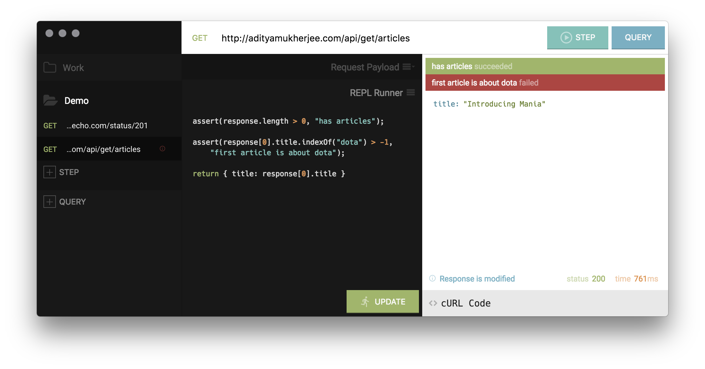

# Mania

Your besty for REST calls.

## Motivations

TL;DR
1. To learn Electron development
2. To have a REST client with REPL for running quick scripts on API responses
3. To allow piping, so that when combined with 2, we have a pseudo test runner

**Learn Electron Development**  
Given the popularity of Electron and my familiarity with pretty much everything around it (except Electron itself), I wanted to see how much friction there actually is in getting a production-ready application created from scratch. Electron isn't the first attempt at letting developers use web technologies to create native-like applications, but it seems to have the most traction in recent memory.

**REST client with REPL**  
My biggest gripe with existing REST clients is that either they are overly complicated, or they're too simple. Every web developer I know, at some point, has created a "test page" that lets them make quick API calls so that they can look at the response and if needed, run some quick scripts on it. For most, it's a blank page with jQuery included. Of course, that suffers from no history saving and carrying over the page from project to project to avoid CORS issues.

I wanted to solve it once and for all for myself.

**Piping**  
One of the most useful things of Promises is promise chaining, and applying transform functions along the way if needed. I wanted to use that same concept to allow creation of a flow of API calls that depend on each others' responses. Very few APIs work in isolation, especially ones that are hidden behind authentication. By creating a flow, it's easy to just run the whole flow rather than make API calls separately and copy over values manually.

There's the added benefit of knowing when a flow breaks, which means something has changed from what was expected and should be investigated.

## Roadmap

1. Support multiple query pipes

## License

[Modified MIT License](LICENSE.md)

## Thanks

This would have taken way longer than necessary without the shoulders of these great projects.

[Postman Echo](https://docs.postman-echo.com/)  
[Codeflask](https://github.com/kazzkiq/CodeFlask.js)  
[React JSON Tree](https://github.com/alexkuz/react-json-tree)  
